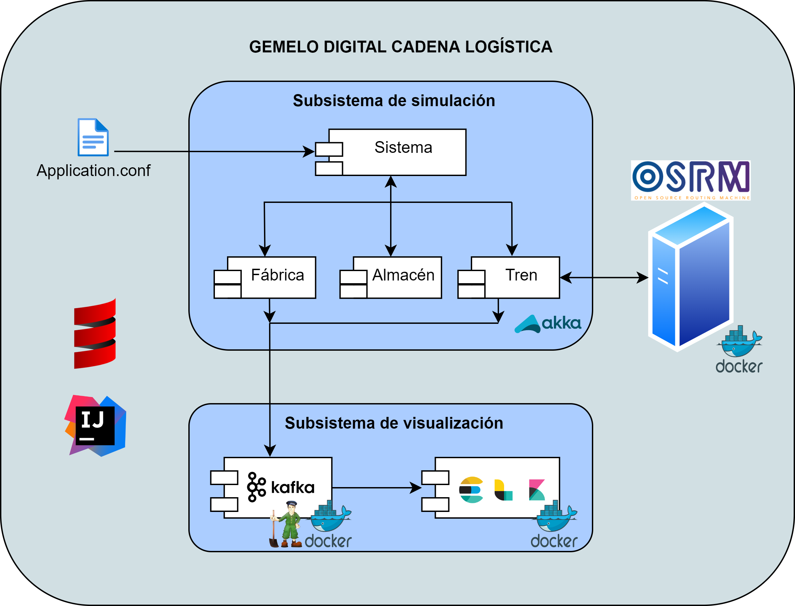

# Gemelo digital de una cadena logística

## Introducción
El sector del transporte y la logística lleva sufriendo durante mucho tiempo de una serie de problemas:
- Retrasos en la cadena logística.
- Sobrecarga de almacenes.
- Rutas de transporte subóptimas.

Una de las tecnologías en las que más se está invirtiendo en este sector para intentar resolverlos son los gemelos digitales.

Un gemelo digital es una réplica de un producto, sistema o proceso que simula el comportamiento de su equivalente físico y real. Esto permite analizar su reacción ante determinadas situaciones, adelantarse a posibles problemas y experimentar sin correr riesgos antes de lanzar nuevas funcionalidades. En el ámbito de la logística, sirve para explorar nuevas combinaciones que mejoren el rendimiento y la eficiencia de los procesos.

Este proyecto trata sobre un gemelo digital de una cadena logística.

## Diseño

### Arquitectura

El gemelo digital está formado por dos subsistemas:
- Un **subsistema de simulación**, encargado de simular los componentes, procesos y comportamiento de la cadena logística basándose en el modelo de actores. Cada componente del sistema está representado por un actor y la interacción con el resto se realiza a través de intercambio de mensajes.
- Un **subsistema de visualización**, encargado de recibir y procesar los eventos generados en el primero para presentar los resultados más importantes.

### Actores
Los principales actores de la simulación son:
- **Fábrica**: Este actor hace referencia al lugar donde se generan y se almacenan los paquetes o mercancías hasta que son recogidos por el tren.
- **Tren**: Este actor hace referencia al medio de transporte empleado para el transporte desde el lugar de origen de los paquetes hasta el destino. El tren sale de una estación existente en el territorio nacional, asociada a la fábrica, y termina en otra estación, asociada al almacén. Este trayecto es realizado a través de la ruta óptima entre origen y destino.
- **Almacén**: Por último, este actor hace referencia a la localización donde se recoge y se almacena la mercancía desde los trenes.

### Eventos
Entre los eventos que se identifican se encuentran:
| Evento | Descripción |
| ------------- | ------------- |
| PAQUETE GENERADO | Se ha generado un paquete en la fábrica |
| INICIO CARGA DEL TREN | Se ha iniciado la carga de los paquetes |
| FIN DE CARGA DEL TREN | Se ha finalizado la carga de los paquetes |
| SALIDA DESDE EL ORIGEN DEL TREN | El tren ha iniciado el viaje |
| SALIDA SIN RETRASO | El tren ha iniciado el viaje a la hora estimada de salida|
| SALIDA CON RETRASO | El tren ha iniciado el viaje pero con cierto retraso de la hora estimada de salida|
| TREN EN VIAJE | El tren está en cierto punto del viaje |
| LLEGADA A DESTINO DEL TREN | El tren ha llegado a su destino |
| INICIO DESCARGA DEL TREN | Se ha iniciado la descarga de los paquetes |
| FIN DESCARGA DEL TREN | Se ha finalizado la descarga de los paquetes |

### Módulos
- **Servidor OSRM**: A través de él se puede realizar el cálculo de rutas reales de transporte óptimas del trayecto.
- **Kafka**: Plataforma de código abierto para la generación y consumo de eventos entre el subsistema de simulación y de visualización.
- **Zookeeper**: Instalado junto a Kafka para el correcto funcionamiento de sus notificaciones.
- **ELK Stack**: Está formado por tres herramientas: Elacticsearch, Logstash y Kibana. Este conjunto de módulos se emplea para poder realizar consultas de los eventos ocurridos en tiempo real y visualizar los resultados en un monitor para poder identificar problemas en la cadena logística.

## Despliegue
Para desplegar el sistema con todos sus módulos listos para ser utilizados no hay que más que escribir el comando `docker-compose up` en la carpeta principal de este proyecto.

## Referencias

#### El perfil de trenes empleado para los viajes se construyó usando [Railnova/osrm-train-profile](https://github.com/railnova/osrm-train-profile)

License.

This code is under the 2-Clause BSD License.

Redistribution and use in source and binary forms, with or without modification, are permitted provided that the following conditions are met:

    - Redistributions of source code must retain the above copyright notice, this list of conditions and the following disclaimer.

    - Redistributions in binary form must reproduce the above copyright notice, this list of conditions and the following disclaimer in the documentation and/or other materials provided with the distribution.
